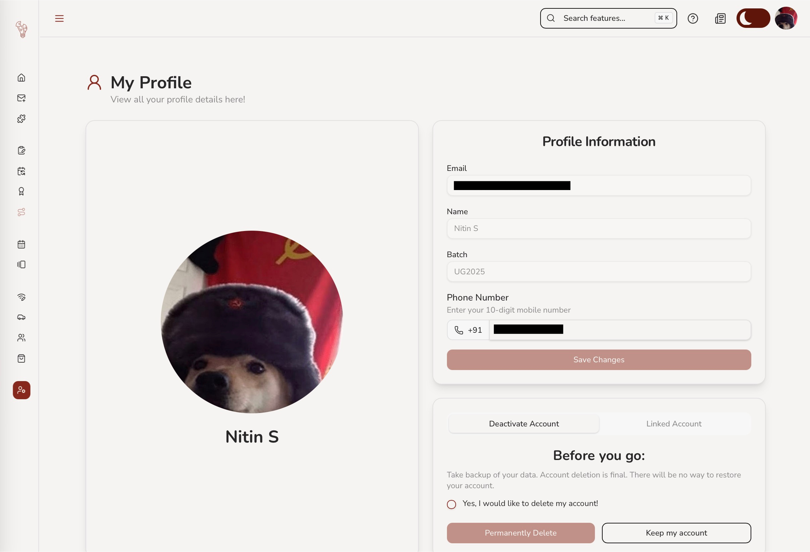

# Detailed overview of all features in the platform

<video src="https://github.com/user-attachments/assets/dfc6a9a4-1d75-4a87-964e-20e4a85a39ef" controls title="Platform Dashboard" width="800"></video>

Dashboard

Dashboard feature with advertisement and announcement spaces, as well as direct links to our most popular features and platform statistics

  

    
  

SG Compose

Email composer to draft and send approved emails to the Ashokan student community from the Student Government email

  

    
  

Games and Puzzles

Coming Soon!

<video src="https://github.com/user-attachments/assets/6b172b08-b99b-4223-a4aa-99d501e8463c" controls title="Course Reviews" width="800"></video>

Course Reviews

Open platform for students to share experiences with various courses undertaken during their semester

  

    
  

Semester Planner

Plan and organize your course schedule

  

    
  

CGPA Planner

Simulates future CGPA scenarios based on expected grades

  

    
  

Events Calendar

List of upcoming events on campus

<video src="https://github.com/user-attachments/assets/fb4f050f-5769-4828-9a5c-332db2cc34ce" controls title="Trajectory Planner" width="800"></video>

Trajectory Planner

Plans your academic journey semester by semester

  

    
  

Organisations Catalogue

Catalogue of all clubs, societies and ministries at Ashoka University

  

    
  

WiFi Tickets

Notify the Ministry and IT about WiFi outages and connectivity issues

<video src="https://github.com/user-attachments/assets/92e723fe-37dc-4f75-ac3b-ead4a2ed5962" controls title="Pool a Cab" width="800"></video>

Pool a Cab

Save money and reduce emissions by sharing cabs with fellow Ashokans

  

    
  

Profile Section

